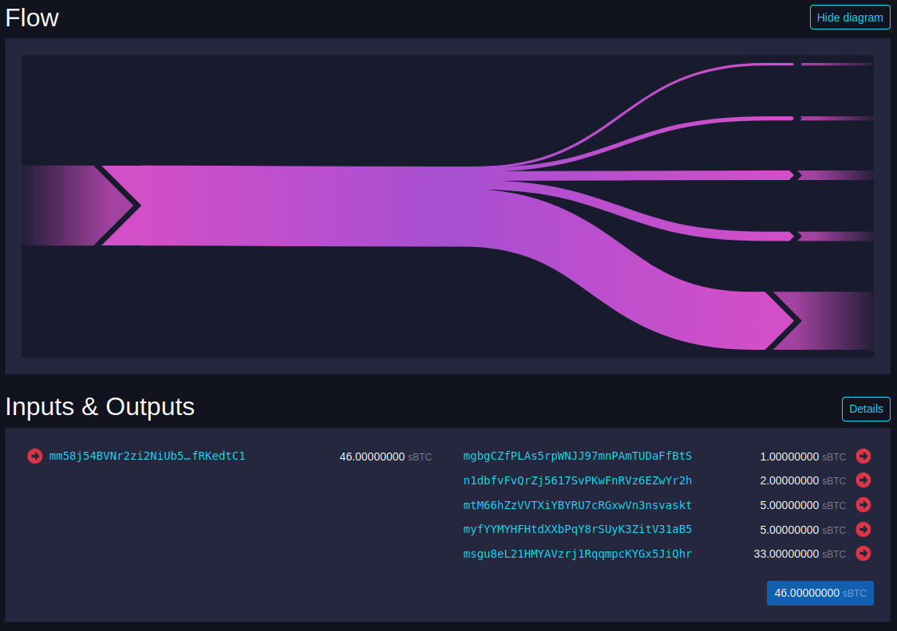

# BBO Faucet [](https://github.com/BcnBitcoinOnly/bbo-faucet/actions/workflows/ci.yml)

A feature-complete fork of [@kallewoof]'s [bitcoin-faucet] built on the PHP+Redis stack, to serve the [BBO signet network].

## Features

* Instant or batched payouts
* User/Pass or cookie RPC authentication
* Optional faucet captcha
* Optional faucet password
* Customizable mempool URL
* Customizable minimum and maximum one-time payout amounts
* Customizable global and per-IP payout limits (both can be disabled)
* Customizable time window to enforce the limits (i.e. limits cooldown time)

## Requirements

* [PHP-FPM 8.4] daemon with the `redis`, `gd` and `mbstring` extensions enabled.
* An HTTP webserver with FastCGI support (Caddy, nginx, Apache etc.)
* [Composer] dependency manager
* Bitcoin node running in signet mode (Core or Knots) with RPC enabled and a wallet with unspent funds
* Redis instance

## Installation

1. Set up a Redis instance
2. Set up a signet network on a Bitcoin Core or Knots node. This node should have a wallet that receives the mining rewards or otherwise plenty of funds to give out. You can refer to [BcnBitcoinOnly/signet-playground](https://github.com/BcnBitcoinOnly/signet-playground) for more information.
3. Clone this project, checkout the latest tag and install the PHP dependencies with `composer install --no-dev --classmap-authoritative`
4. Set up a webserver with FastCGI support and configure it properly, including the faucet's environment variables (see below). Caddy is recommended for its ease of use.

## Configuration

### Environment Variable Reference

The following environment variables can be used to configure your faucet instance.

| Environment Variable Name       | Description                                                  | Sensible Value                | Mandatory Value? |
|---------------------------------|--------------------------------------------------------------|-------------------------------|------------------|
| `FAUCET_DEBUG`                  | Debug mode (for development)                                 | `0`                           | Yes              |
| `FAUCET_REDIS_ENDPOINT`         | Redis endpoint                                               | `localhost:6379`              | Yes              |
| `FAUCET_REDIS_PREFIX`           | Prefix for all Redis keys                                    | `faucet:`                     | Yes              |
| `FAUCET_BITCOIN_RPC_ENDPOINT`   | Bitcoin node RPC endpoint                                    | `http://localhost:38332`      | Yes              |
| `FAUCET_BITCOIN_RPC_COOKIE`     | Path to RPC cookie                                           | Path to the node's cookiefile | No               |
| `FAUCET_BITCOIN_RPC_USER`       | RPC User. Prefer cookie auth                                 | `user`                        | No               |
| `FAUCET_BITCOIN_RPC_PASS`       | RPC Pass. Prefer cookie auth                                 | `pass`                        | No               |
| `FAUCET_BITCOIN_RPC_WALLET`     | Wallet name. Required when the node has more than one wallet |                               | No               |
| `FAUCET_FEE_RATE`               | Fee rate to use in the transactions. Default is 1 s/vB.      | `1`                           | No               |
| `FAUCET_NAME`                   | Text displayed on the faucet                                 | `Your Signet Faucet`          | Yes              |
| `FAUCET_MIN_ONE_TIME_BTC`       | Minimum payout users can claim                               | `0.001`                       | Yes              |
| `FAUCET_MAX_ONE_TIME_BTC`       | Maximum payout users can claim                               | `5.0`                         | Yes              |
| `FAUCET_USER_SESSION_TTL`       | Seconds until the per-IP limit cools down                    | `3600`                        | Yes              |
| `FAUCET_GLOBAL_SESSION_TTL`     | Seconds until the global limit cools down                    | `3600`                        | Yes              |
| `FAUCET_USER_SESSION_MAX_BTC`   | How many bitcoin can each IP collect in the time window      | `20.0`                        | No               |
| `FAUCET_GLOBAL_SESSION_MAX_BTC` | How many bitcoin can all users collect in the time window    | `150.0`                       | No               |
| `FAUCET_USE_CAPTCHA`            | Activate captcha (requires `gd` extension)                   | `0`                           | Yes              |
| `FAUCET_USE_BATCHING`           | Activate batched payouts. Needs further config               | `0`                           | Yes              |
| `FAUCET_PASSWORD_BCRYPT_HASH`   | Bcrypt hash of the faucet's password                         | Read Password section         | No               |
| `FAUCET_MEMPOOL_URL`            | Mempool URL where to show the instant payout transactions    | `https://mempool.example.com` | No               |

### Password

In order to avoid storing plain text secrets the faucet settings use a BCrypt hash instead of the password itself.

Run the `bin/bcrypt.php` helper script to get a ready-made `FAUCET_PASSWORD_BCRYPT_HASH` definition from any given password.

```shell
$ php bin/bcrypt.php n0s3c0ndb3st
FAUCET_PASSWORD_BCRYPT_HASH='$2y$10$cNZwPXN5N8.RUBrMNfZOhuT9ClWv0fWawSaxE4rTXbgTjrNVJTko2'
```

### Transaction Batching



Transaction batching instructs the faucet to withhold approved payouts to send them later on as a single transaction.
To enable this mode, set `FAUCET_USE_BATCHING=1`.

You also need to set up a cronjob that runs `bin/batch.php` at your preferred interval.
Run `crontab -e` to edit the current user's crontab file.

In [`docs/cron`](docs/cron/sample) there's an example on how to set up one such cronjob that runs every 15 minutes.

### Usage Limits

TODO

### Webservers

#### Caddy

TODO

#### nginx

TODO

### Development

For development tasks Docker, the PHP CLI and Composer are assumed to be installed locally.
The development stack runs containerized Caddy and PHP-FPM containers, but Composer is used as a task runner tool.

```shell
$ docker compose up -d
$ composer install
$ composer setup
```

After these commands the faucet will be available at `http://localhost:8080`, and set up with a regtest node with a wallet and 101 blocks already mined.

The `composer.json` file also has tasks for fetching new addresses from the node's wallet, mining additional regtest blocks, running the test suite and applying the code linter:

```shell
$ composer lint
$ composer mine
$ composer newaddress
$ composer test
```

Arbitrary `bitcoin-cli` commands can be run like so:

```shell
$ docker compose exec node bitcoin-cli help send
```

To customize the Docker stack create a `compose.override.yml` at the root. On `docker compose up -d` it'll be automatically merged with `compose.yml`.
Example, with custom environment variables and exposed Redis port for debugging:

```yaml
name: faucet

services:
  php-fpm:
    env_file:
      - .env
  redis:
    ports:
      - 127.0.0.1:6379:6379
```

To customize the default environment variables create an `.env` file and set it up as an extra `env_file` for `php-fpm` as shown above.
Example:

```
FAUCET_USE_CAPTCHA=1
FAUCET_PASSWORD_BCRYPT_HASH='$2y$10$MyYyMkeWk2v4tvzA5lylyuWBsBXsvOfcGeCG61C9mVOdXDx1/BnyO'
```

Changing environment variables requires recreating the `php-fpm` container.


[@kallewoof]: https://github.com/kallewoof
[bitcoin-faucet]: https://github.com/kallewoof/bitcoin-faucet
[BBO signet network]: https://faucet.bitcoinbarcelona.xyz/
[PHP-FPM 8.4]: https://launchpad.net/~ondrej/+archive/ubuntu/php
[Composer]: https://getcomposer.org/
